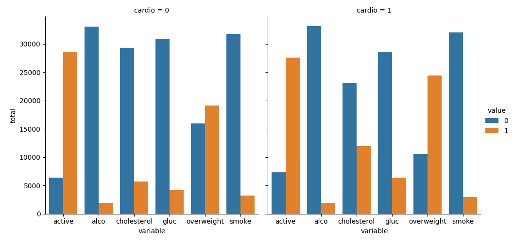
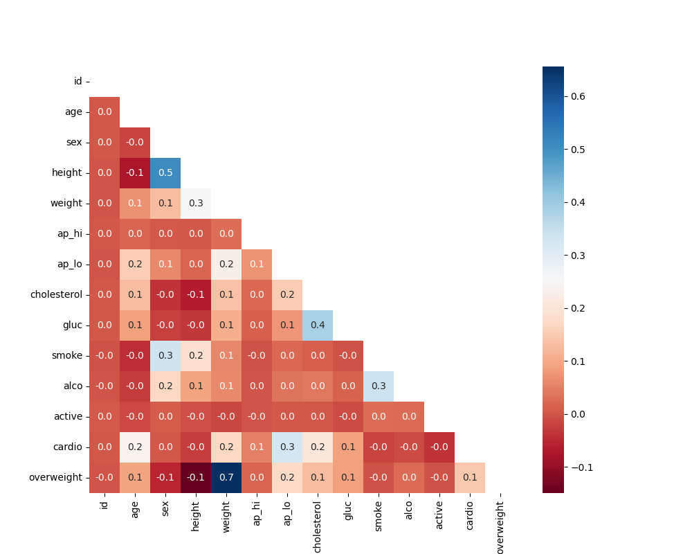

# Medical Data Visualizer
freeCodeCamp_Data Analysis with Python_Project 

Tools: Python, Pandas, Seaborn, Matplotlib

Summary: This project explores and visualized data from a medical examination survey to reveal patterns in health indicators and lifestyle factors.

Analysis:
- Calculated BMI and classified individuals as overweight or not
- Normalized cholesterol and glucose features for consistent comparison
- Created a categorical plot to compare health-related variables across groups
- Generated a heatmap to display correlations between medical variables after data cleaning

Key Skills: Data preprocessing, feature transformation, categorical plotting, correlation analysis, EDA (exploratory data analysis)

